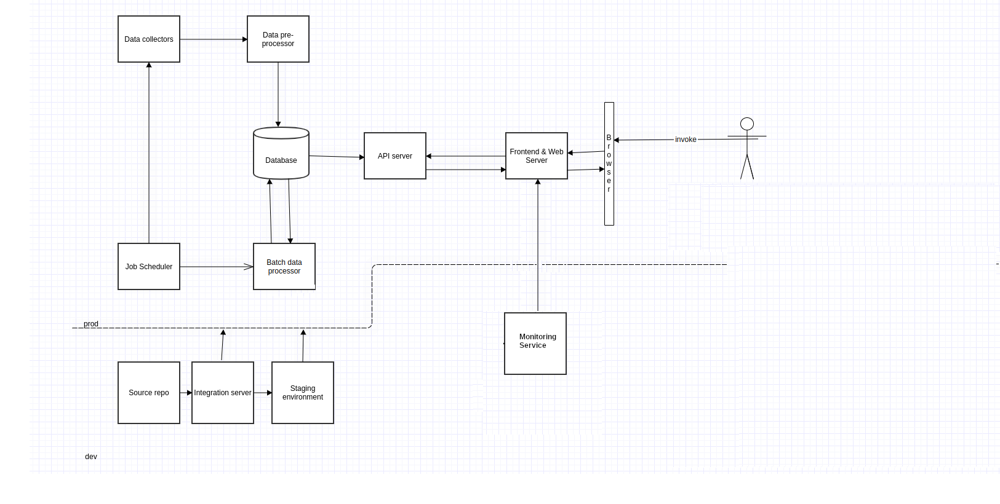
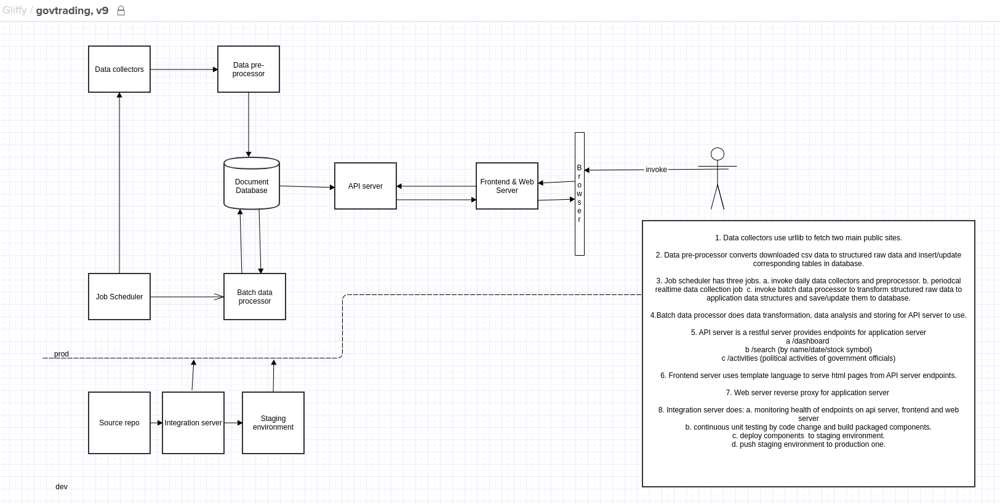
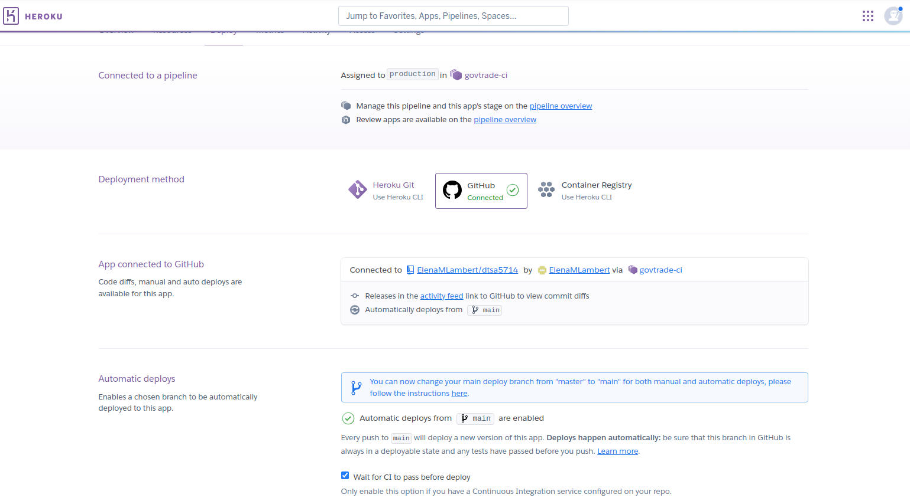
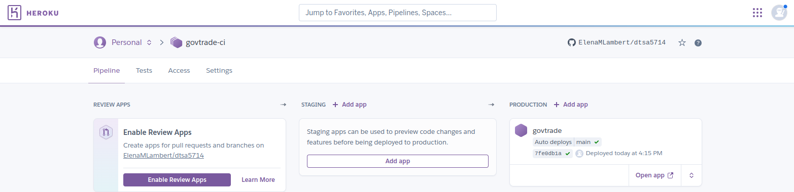
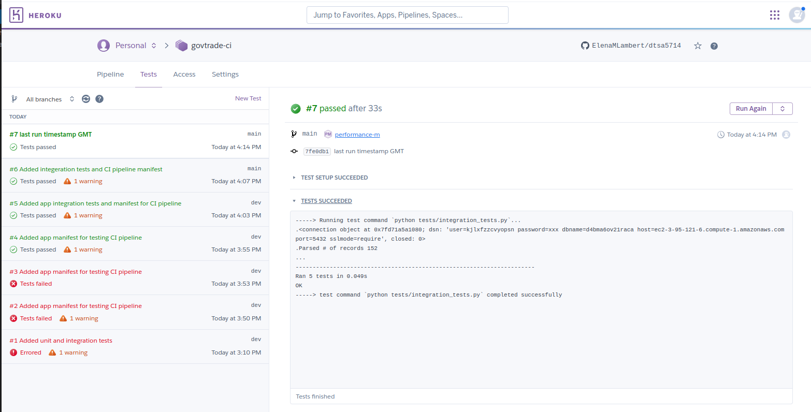
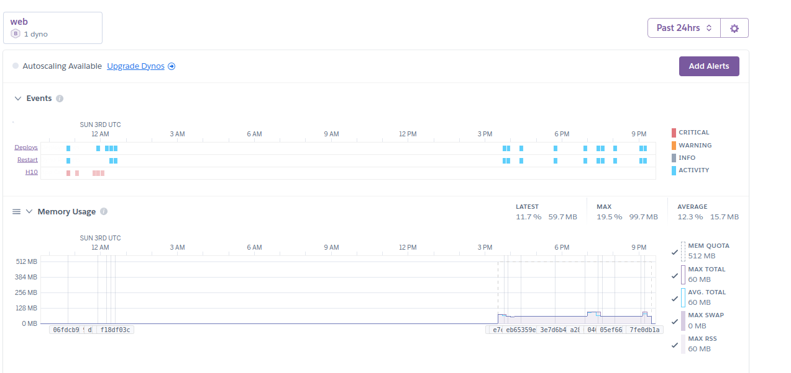
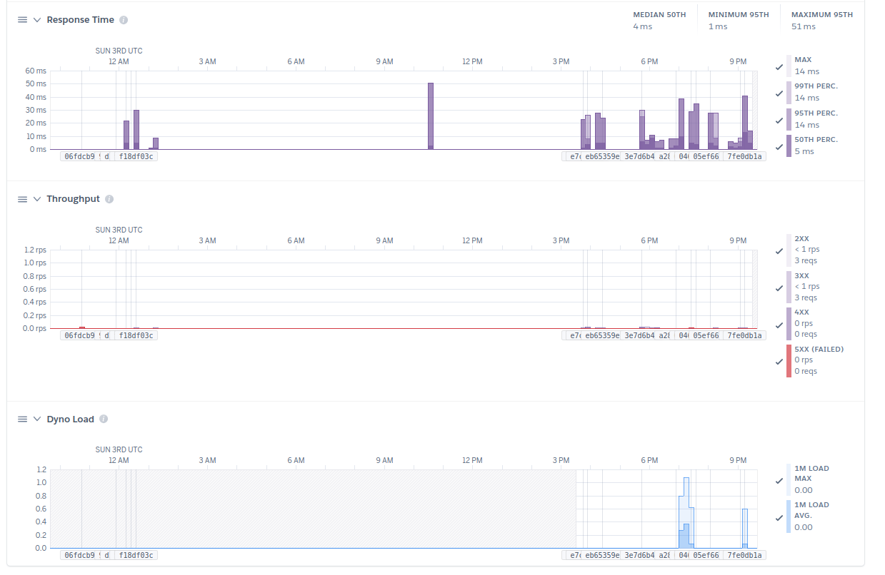

<strong>Project description: </strong>
The problem my project is aimed at solving is combating the distributed, unorganized information of government officials’ financial decisions. my project is for anyone who is interested in government officials’ financial disclosures and including their stocks and options transactions records. my project is unique because it identifies the ways in which political activities correlate with government officials’ financial transactions records. This enables transparency, eliminates the potential for insider trading, and identifies potential conflicts of interest. It allows retail investors to monitor and subsequently follow their trades before restrictions are made. 
<strong>Applicaiton Stack Architecture:</strong>
## Overview

### Architecture

 

Architecture Description
1. Data collectors use urllib to fetch two main public sites.

2. Data pre-processor converts downloaded csv data to structured raw data and insert/update corresponding tables in database.
 
3. Job scheduler has two jobs. 

   a. invoke periodical data collectors and preprocessor.

   b. invoke batch data processor to transform structured raw data to application data structures and save/update them to database.

4. Batch data processor does data transformation, data analysis and storing data for API server to use.

5. API server provides endpoints for application servera /dashboardb /search (by name/filing date/stock symbol)

6. Frontend server uses template language to serve html pages from API server endpoints.

7. Web server reverse proxy for application server

8. Integration server does: 

    a. monitoring health of endpoints on api server, frontend, and web server.                                                                                            
    b. continuous integration testing by code change and build

Diagram Before (Week 1):

Minor design changes are:
1. Relational(Postgresql) database was chosen and replaced document database. The decision was based on that the data size of government trades is relatively small and changes infrequently. 
2. Monitoring services were added, using heroku services.

### Auto Deployment
### 
 Application integrates with GitHub to make it easy to deploy to my app stack running on Heroku. When GitHub integration is configured for my app, Heroku can automatically build and release (if the build is successful).

### CI Pipeline
 Continuous Integration implemented by using Heroku pipeline, it runs tests automatically for every subsequent code push to my GitHub repository.  Along with any merges to master from dev branch (which is used as staging).
### 

### Integration Tests
 Tests are written standard pyunit packages and running continously upon each code push in github.
### 

### Monitoring
 Heroku provides application server metrics, that includes Response time, Memory, Throughput and alerts service.

### 
### 

 

<strong>Code Structure:</strong>

### Web Application ([app.py](src/app.py)/[service.py](src/service.py))
 1. Standard flask app, that uses routing/templates to render web page.
 2. Apscheduler BackgroundScheduler is started when app.py starts, it runs [fetcher.py](src/fetcher.py) 'main' method periodcally (every two hours). The timestamp of data collection is displayed on the bottom of the site page.
 3. [service.py](src/service.py) provides db records for the page by retrieving them from database. It does certain trades data convertions on unstructured raw data.

#### Data Collection
1. [fetcher.py](src/fetcher.py) uses Python requests lib to fetch two main public sites.
  respectively: 
    - https://disclosures-clerk.house.gov/public_disc/financial-pdfs/2024FD.zip all congress members' trades list disclosed in 2024.
    - https://disclosures-clerk.house.gov/public_disc/ptr-pdfs/2024/{docId} individual trade disclosure doc record.
    
    - fetcher.py attaches individual parsed trade doc to record
    - fetcher.py save records to postgresql database (hosted in Heroku)

2. [processor.py](src/processor.py) helps fetcher.py convert raw data to structured records, extracts trades from trade pdf doc per record.
3. [db.py](src/db.py) inserts corresponding records to postgresql database hosted in heroku.
4. DB is postgresql, connection parameters are in .env file.
Sample db records screenshot [here](static/img/db_records.png).

#### Frontend
HTML page sort/search functionality is using sortable.js, the bottom displays data collection time.

#### <strong>Public url of my project:   </strong>    [https://govtrade-a46bca12cc9b.herokuapp.com/](https://govtrade-a46bca12cc9b.herokuapp.com/)

#### Run project code locally, under project root directory:
     `python3 -m venv venv`
     `source ./venv/bin/activate`
     `pip install -r requirements.txt`
     `export FLASK_APP=src/app.py`
     `flask run --port 1234 --debug`

